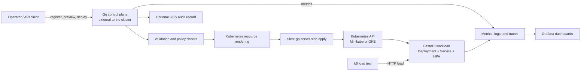

# Service Launchpad

[](https://github.com/ChaosRez/service-launchpad/actions/workflows/ci.yml)
[](go.mod)
[](LICENSE)

Service Launchpad is a Go-based deployment control plane that turns service definitions into policy-checked Kubernetes resources. It provides a focused internal-platform workflow: register a service, preview its deployment plan, apply it with `client-go`, and inspect the result through metrics, logs, traces, and load tests.

**Status:** Active development. The complete local platform loop is validated on Minikube. The GKE workload and observability path is ready for live deployment and verification from a host with private cluster access.

The sample FastAPI workload is intentionally straightforward. The engineering focus is the platform around it: deployment safety, Kubernetes automation, observability, infrastructure as code, and clear operational boundaries.

## Highlights

- Go control-plane API for service registration, inspection, manifest preview, and deployment.
- Kubernetes server-side apply through `client-go`, with `kubectl` retained as a local debugging fallback.
- Policy enforcement before cluster mutation, covering image sources, replica bounds, namespaces, resource kinds, probes, resource limits, security settings, and service exposure.
- Standardized Namespace, ConfigMap, Deployment, Service, and HorizontalPodAutoscaler generation.
- Observable inference-style workload with health/readiness endpoints, Prometheus metrics, OpenTelemetry traces, and an OpenAI-style chat-completion API.
- Grafana dashboards backed by VictoriaMetrics/Mimir, Tempo, and Loki, plus in-cluster `k6` load generation.
- Terraform, Kustomize, Artifact Registry image publishing, GCS deployment audits, and multi-surface CI validation.

## Architecture



The control plane stays outside the managed cluster. Locally it uses the developer's kubeconfig; this keeps the platform boundary visible and lets the same deployment logic be exercised without hiding it behind an in-cluster service account.

### Deployment Flow

1. `POST /services` validates and stores a service definition.
2. `GET /services/{name}/manifests` previews the generated Kubernetes resources.
3. `POST /services/{name}/deploy` repeats definition and rendered-resource policy checks.
4. The `client-go` deployer applies the approved resources with server-side apply.
5. The response reports the applied resource set and can write a deployment audit record to GCS.

Detailed API and configuration documentation lives in [`services/control-plane`](services/control-plane/README.md).

## Project Status

| Capability | State |
| --- | --- |
| Local control plane to Minikube | **Validated end to end** through an automated smoke test. |
| Workload and platform observability | **Validated locally** with dashboards, traces, logs, and load testing. |
| CI | **Active** across Go, Python, containers, Terraform, and Kubernetes manifests. |
| GKE workload and observability deployment | **Operator access verified** through the IAM-authenticated DNS endpoint; platform apply and telemetry verification remain pending. |
| Externally hosted production control plane | **Next milestone** after the GKE platform path is verified. |

## Quickstart

Prerequisites: Docker, Go 1.25, Minikube, `kubectl`, and `curl`.

```bash
git clone https://github.com/ChaosRez/service-launchpad.git
cd service-launchpad
./scripts/smoke-test-fastapi-service.sh --cleanup
```

The smoke test starts Minikube, builds the sample workload, runs the Go control plane, registers and deploys the service through `client-go`, waits for rollout, and verifies the workload endpoints.

See [`scripts/README.md`](scripts/README.md) for isolated-cluster options, image publishing, production deployment, and load testing.

## Observability and Load Testing

The local environment combines:

- `vmagent`, VictoriaMetrics, and Mimir for metrics;
- Tempo for distributed traces;
- Loki and Promtail for logs;
- kube-state-metrics for cluster state;
- Grafana with pre-provisioned workload, control-plane, load-test, and storage-comparison dashboards.

VictoriaMetrics and Mimir are used together deliberately to compare operational characteristics; this is not a recommendation to duplicate metrics storage in every production platform.

```bash
kubectl apply -k k8s/monitoring
kubectl wait --for=condition=Available deployment --all \
  -n service-launchpad-observability --timeout=5m
kubectl port-forward svc/grafana 3000:3000 -n service-launchpad-observability
```

Open <http://127.0.0.1:3000> with the local-only credentials `admin` / `admin`.

Generate in-cluster load:

```bash
./scripts/load-test-fastapi-service.sh --profile long --rate 35 --duration 6m
```

| Control-plane dashboard | Workload dashboard |
| :---: | :---: |
|  |  |

### Trace Drilldown


## GKE Deployment Path

The committed production path includes:

- Terraform for the GCP network, Artifact Registry, GCS, and a private-node GKE cluster with DNS and private-IP control-plane paths;
- production Kustomize overlays for the workload and observability stack;
- immutable `git-<sha>` image publishing to Artifact Registry;
- a deployment script and runbook for IAM-authenticated operator access through the GKE DNS endpoint;
- CI rendering and schema validation for the production manifests.

The next verification milestone is to deploy the workload and observability stack to GKE, confirm metrics/logs/traces, and document the resulting operational evidence. Running the control plane as an authenticated external cloud service follows that milestone and is not presented as a completed repository capability.

See the [production runbook](docs/production-platform-runbook.md) and [network/access design](docs/production-network-access.md) for the current deployment boundary.

## Repository Map

| Path | Purpose |
| --- | --- |
| [`services/control-plane`](services/control-plane) | Go API, policy enforcement, resource rendering, cluster apply, metrics, and audit recording. |
| [`services/fastapi-service`](services/fastapi-service) | Observable inference-style sample workload. |
| [`k8s`](k8s) | Local resources, monitoring stack, and production overlays. |
| [`infra/terraform`](infra/terraform) | GCP environments and reusable GKE infrastructure. |
| [`loadtests/k6`](loadtests/k6) | In-cluster workload traffic generation. |
| [`scripts`](scripts) | Bootstrap, smoke-test, load-test, publishing, and deployment workflows. |
| [`docs`](docs) | Architecture, decisions, environment model, CI scope, and production runbooks. |

## Verification

GitHub Actions validates:

- Go formatting, tests, and the control-plane container build;
- Python tests and the workload container build;
- Terraform formatting and validation;
- Kustomize rendering for local and production resources;
- offline Kubernetes schema validation with `kubeconform`.

Cloud applies and load tests intentionally remain operator-run workflows. See [`docs/ci.md`](docs/ci.md) for the exact CI boundary.

## Scope

Service Launchpad is a focused engineering prototype rather than a general-purpose production PaaS. It does not yet provide continuous controller reconciliation, progressive delivery, automated rollback, or multi-tenant isolation. Those are explicit follow-up decisions, not implied capabilities.

Near-term milestones:

1. Deploy and verify the production workload and observability stack on GKE.
2. Run the same control plane as an authenticated external cloud service.
3. Validate the complete cloud deployment path, audit evidence, failure handling, and cleanup behavior.

## Documentation

- [Architecture](docs/architecture.md)
- [Decisions and tradeoffs](docs/decisions.md)
- [Environment model](docs/environments.md)
- [CI scope](docs/ci.md)
- [Production platform runbook](docs/production-platform-runbook.md)
- [Control-plane guide](services/control-plane/README.md)
- [Monitoring guide](k8s/monitoring/README.md)

## License

This project is available under the [MIT License](LICENSE).
