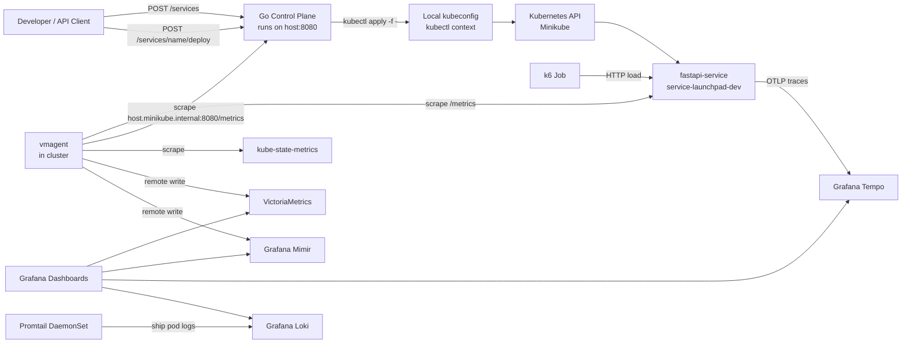

# Service Launchpad Architecture

Service Launchpad is a small platform-engineering demo that shows how a control plane can register, deploy, scale, and observe a service on Kubernetes. The current implementation is optimized for the local `Minikube` path through Phase 5, with explicit notes for how the same shape would evolve toward `GKE`.

## Goals

- Provide a tiny but realistic service registration and deployment workflow.
- Demonstrate Kubernetes deployment primitives: `Deployment`, `Service`, `ConfigMap`, and `HorizontalPodAutoscaler`.
- Make both the workload and platform layer visible through metrics, logs, traces, and dashboards.
- Keep local development simple enough to demo live in an interview.
- Leave clear extension points for cloud Kubernetes, Terraform, IAM, and stronger deployment safety.

## Components

| Component | Location | Responsibility |
| --- | --- | --- |
| `control-plane` | `services/control-plane` | Go API for service registration, validation, manifest rendering, cluster apply, health, readiness, and platform metrics. |
| `fastapi-service` | `services/fastapi-service` | OpenAI-compatible chat completion simulator used as the deployable workload. |
| Base Kubernetes manifests | `k8s/base` | Local workload namespace, deployment, service, config, and HPA defaults. |
| Monitoring stack | `k8s/monitoring` | VictoriaMetrics, Mimir, vmagent, kube-state-metrics, Tempo, Loki, Promtail, and Grafana dashboards. |
| Load test | `loadtests/k6` and `scripts/load-test-fastapi-service.sh` | In-cluster `k6` load generation against the workload service. |
| Minikube bootstrap | `scripts/bootstrap-minikube.sh` | Local cluster setup and developer bootstrap flow. |
| Terraform and GKE path | `infra/terraform` | Planned cloud infrastructure path for GCP IAM, networking, and optional GKE deployment. |

## Current Local Architecture

The current local architecture intentionally keeps the Go control plane outside Kubernetes. It shells out to local `kubectl`, so it uses the developer machine's kubeconfig and active context. This is simpler for the current phase and keeps cluster credentials out of an in-cluster control-plane pod.

## Request Flow

1. A user submits a service definition to `POST /services`.
2. The control plane validates required fields such as name, image, port, replicas, and autoscaling configuration.
3. The service definition is stored in memory by default, with optional JSON file persistence.
4. A user calls `POST /services/{name}/deploy`.
5. The control plane renders Kubernetes resources:
   - `Namespace`
   - `ConfigMap`
   - `Deployment`
   - `Service`
   - `HorizontalPodAutoscaler` when autoscaling is enabled
6. The control plane applies those manifests with `kubectl apply -f -`.
7. Kubernetes schedules the workload in `service-launchpad-dev`.
8. `vmagent`, `kube-state-metrics`, and Grafana make the workload and deployment state observable.

## Control Plane API Surface

The control plane exposes:

- `GET /health` for liveness.
- `GET /ready` for readiness and status metadata.
- `GET /metrics` for Prometheus text-format metrics compatible with `vmagent` and VictoriaMetrics.
- `POST /services` to register service definitions.
- `GET /services` and `GET /services/{name}` to inspect registered definitions.
- `GET /services/{name}/manifests` to preview generated Kubernetes manifests.
- `POST /services/{name}/deploy` to apply the generated manifests.

Current platform metrics include:

- `service_launchpad_control_plane_service_registrations_total`
- `service_launchpad_control_plane_deployments_total`
- `service_launchpad_control_plane_deployment_duration_seconds`
- `service_launchpad_control_plane_managed_services`

## Workload Runtime

`fastapi-service` simulates an inference-style API without needing a real model server. It provides:

- health and readiness endpoints
- model listing
- chat completion endpoint
- request counters
- latency histograms
- error counters
- OpenTelemetry trace export to Tempo

The Kubernetes deployment includes resource requests and limits, probes, labels, and HPA support. This makes the workload useful for scaling and observability demos even though the business logic is intentionally small.

## Monitoring Path

The monitoring stack runs inside `service-launchpad-observability`.

`vmagent` scrapes:

- `fastapi-service.service-launchpad-dev.svc.cluster.local:8000`
- local host control plane through `host.minikube.internal:8080`
- `kube-state-metrics`
- VictoriaMetrics
- Mimir

`vmagent` remote-writes metrics to:

- VictoriaMetrics for lightweight local querying
- Mimir for long-term metrics storage practice and comparison

Grafana is provisioned with datasources for:

- VictoriaMetrics
- Mimir
- Tempo
- Loki

Grafana dashboards show:

- FastAPI service request rate, latency, errors, SLOs, and replica behavior.
- Control-plane scrape health, managed service count, registrations, deployments, and deployment duration.
- k6 load-test traffic and failure behavior.
- VictoriaMetrics vs Mimir storage comparison.

Logs flow from pods through Promtail into Loki. Traces flow from `fastapi-service` into Tempo.

## Local Network Boundaries

The local `Minikube` path uses two namespaces:

- `service-launchpad-dev` for the workload managed by the control plane.
- `service-launchpad-observability` for metrics, traces, logs, and dashboards.

The control plane currently runs on the host, outside the cluster:

- It reaches the cluster through local `kubectl`.
- It uses the active kubeconfig context.
- It is scraped from inside Minikube through `host.minikube.internal:8080`.

The workload is reachable inside the cluster through its Kubernetes `Service`. For local developer access, port-forwarding or Minikube service access can be used.

There is no ingress controller in the current local path. That is intentional: the local demo focuses on registration, deployment, autoscaling, and observability rather than public traffic routing.

## Local vs GKE Path

| Concern | Local Minikube | Future GKE path |
| --- | --- | --- |
| Control plane runtime | Runs on developer host. | Could run outside the cluster for admin workflows, or inside the cluster with RBAC and `client-go`. |
| Cluster access | Local `kubectl` and kubeconfig. | GKE kubeconfig, Workload Identity, or CI/CD identity. |
| Metrics scraping | In-cluster `vmagent` scrapes host via `host.minikube.internal`. | Prefer in-cluster control plane scraping, external scrape endpoint, or remote-write from the control plane. |
| Workload exposure | ClusterIP and local port-forwarding. | Ingress or Gateway API with DNS and TLS. |
| Networking | Single local Minikube network. | VPC, regional subnets, firewall rules, private or public control-plane endpoint decisions. |
| IAM | Local developer identity. | Least-privilege service accounts, Workload Identity, and environment-specific roles. |
| Storage retention | Local ephemeral stores. | Explicit retention, backup, object storage, and cost controls. |

## GKE Network Boundaries

The planned GKE architecture should keep the same logical components but add cloud network boundaries:

- A dedicated VPC for the project or environment.
- Separate subnet ranges for GKE nodes and pods/services when using VPC-native clusters.
- Explicit firewall rules for cluster access.
- A clear decision for public vs private GKE control-plane endpoint access.
- Ingress or Gateway API for any external application traffic.
- Internal service-to-service traffic through Kubernetes `Service` DNS.
- Observability access through private services, port-forwarding, or authenticated ingress depending on environment.

For staging and production, the control plane should not rely on a developer laptop. The likely production direction is either:

- run the control plane inside the cluster with namespace-scoped RBAC and `client-go`, or
- run it as an external service with a dedicated cloud identity and a secure Kubernetes API access path.

The in-cluster model is closer to a Kubernetes operator or platform controller. The external model is closer to an admin API or deployment orchestrator. Both are valid, but production would need explicit authentication, authorization, audit logging, and deployment rollback behavior.

## Ingress and Traffic Boundaries

Current local path:

- no public ingress
- workload traffic stays inside the cluster
- developer access uses API calls, port-forwarding, or scripts

Future GKE path:

- external users reach workloads through Ingress or Gateway API
- TLS terminates at the load balancer or ingress controller
- internal service calls use Kubernetes DNS and ClusterIP services
- Grafana and observability backends should be private or protected by authentication

## Reliability and Scaling

The workload has:

- readiness and liveness probes
- CPU and memory requests and limits
- HPA support based on CPU utilization
- k6 load testing to demonstrate throughput, latency, and scaling behavior

The control plane has:

- validation before deployment
- duplicate registration protection
- health and readiness endpoints
- deployment success and failure metrics
- deployment duration histogram

Intentional simplifications:

- deployments are applied with `kubectl`, not `client-go`
- storage is in-memory or JSON file backed, not a database
- generated manifests are simple and explicit
- no authn/authz yet on the control-plane API
- no rollback strategy yet
- no multi-environment release promotion yet

## Security Notes

Current local security is intentionally lightweight. Before using this outside a local demo, the project would need:

- authentication on the control-plane API
- authorization around who can register or deploy services
- tighter Kubernetes RBAC
- audit logging for deployment actions
- image provenance or admission controls
- secret handling through Kubernetes `Secret` or an external secret manager
- network policies between workload and observability namespaces

## Talking Points for interview

- The project starts with Minikube to prove the platform workflow quickly before adding cloud complexity.
- The control plane stays outside the cluster for now because it shells out to `kubectl`.
- Observability covers both the managed workload and the platform service itself.
- VictoriaMetrics is the fast local metrics store; Mimir is included to discuss longer-term storage tradeoffs.
- Tempo and Loki complete the metrics, traces, and logs story.
- The GKE path is intentionally framed as a next step with stronger IAM, networking, and runtime decisions.
