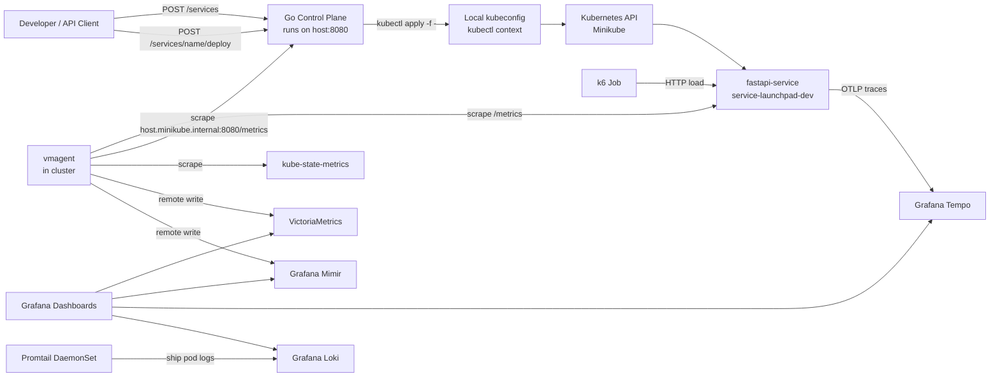

# Service Launchpad Architecture

Service Launchpad is a small platform-engineering demo that shows how an external control plane can register, deploy, scale, and observe a service on Kubernetes. The current implementation is optimized for the local `Minikube` path, with a required production path where the same control-plane service runs on Cloud Run and deploys workloads to `GKE production`.

## Goals

- Provide a tiny but realistic service registration and deployment workflow.
- Demonstrate Kubernetes deployment primitives: `Deployment`, `Service`, `ConfigMap`, and `HorizontalPodAutoscaler`.
- Make both the workload and platform layer visible through metrics, logs, traces, and dashboards.
- Keep local development simple enough to demo live in an interview.
- Make cloud Kubernetes, Cloud Run, Terraform, IAM, and stronger deployment safety part of the required production story.

## Components

| Component | Location | Responsibility |
| --- | --- | --- |
| `control-plane` | `services/control-plane` | Go API for service registration, validation, manifest rendering, cluster apply, health, readiness, and platform metrics. |
| `fastapi-service` | `services/fastapi-service` | OpenAI-compatible chat completion simulator used as the deployable workload. |
| Base Kubernetes manifests | `k8s/base` | Local workload namespace, deployment, service, config, and HPA defaults. |
| Monitoring stack | `k8s/monitoring` | VictoriaMetrics, Mimir, vmagent, kube-state-metrics, Tempo, Loki, Promtail, and Grafana dashboards. |
| Load test | `loadtests/k6` and `scripts/load-test-fastapi-service.sh` | In-cluster `k6` load generation against the workload service. |
| Minikube bootstrap | `scripts/bootstrap-minikube.sh` | Local cluster setup and developer bootstrap flow. |
| Terraform and GKE path | `infra/terraform` | Planned cloud infrastructure path for GCP IAM, networking, Cloud Run control plane, and required `GKE production`. |

## Current Local Architecture

The current local architecture intentionally keeps the Go control plane outside Kubernetes. It shells out to local `kubectl`, so it uses the developer machine's kubeconfig and active context. This is simpler for the current phase and avoids designing production cloud identity before the local platform flow is proven.

This `kubectl` shell-out is a deliberate local implementation shortcut. Once `client-go` exists, `kubectl` should remain only as a local fallback / debug path. Minikube should validate the same `client-go` deployer path before Cloud Run uses it against `GKE production`. The first `client-go` target should cover the resources already generated today: `Namespace`, `ConfigMap`, `Deployment`, `Service`, and `HorizontalPodAutoscaler`.


```mermaid
flowchart LR
  User["Developer / API Client"]
  CP["Go Control Plane<br/>runs on host:8080"]
  Kubeconfig["Local kubeconfig<br/>kubectl context"]
  API["Kubernetes API<br/>Minikube"]
  Workload["fastapi-service<br/>service-launchpad-dev"]
  VMAgent["vmagent<br/>in cluster"]
  VM["VictoriaMetrics"]
  Mimir["Grafana Mimir"]
  KSM["kube-state-metrics"]
  Tempo["Grafana Tempo"]
  Loki["Grafana Loki"]
  Promtail["Promtail DaemonSet"]
  Grafana["Grafana Dashboards"]
  K6["k6 Job"]

  User -->|POST /services| CP
  User -->|POST /services/name/deploy| CP
  CP -->|kubectl apply -f -| Kubeconfig
  Kubeconfig --> API
  API --> Workload
  K6 -->|HTTP load| Workload

  Workload -->|OTLP traces| Tempo
  VMAgent -->|scrape /metrics| Workload
  VMAgent -->|scrape host.minikube.internal:8080/metrics| CP
  VMAgent -->|scrape| KSM
  VMAgent -->|remote write| VM
  VMAgent -->|remote write| Mimir
  Promtail -->|ship pod logs| Loki
  Grafana --> VM
  Grafana --> Mimir
  Grafana --> Tempo
  Grafana --> Loki
```

## Request Flow

1. A user submits a service definition to `POST /services`.
2. The control plane validates required fields such as name, image, port, replicas, and autoscaling configuration.
3. The service definition is stored in memory by default, with optional JSON file persistence.
4. A user calls `POST /services/{name}/deploy`.
5. The control plane renders Kubernetes resources:
   - `Namespace`
   - `ConfigMap`
   - `Deployment`
   - `Service`
   - `HorizontalPodAutoscaler` when autoscaling is enabled
6. The control plane applies those manifests with `kubectl apply -f -`.
7. Kubernetes schedules the workload in `service-launchpad-dev`.
8. `vmagent`, `kube-state-metrics`, and Grafana make the workload and deployment state observable.

## Control Plane API Surface

The control plane exposes:

- `GET /health` for liveness.
- `GET /ready` for readiness and status metadata.
- `GET /metrics` for Prometheus text-format metrics compatible with `vmagent` and VictoriaMetrics.
- `POST /services` to register service definitions.
- `GET /services` and `GET /services/{name}` to inspect registered definitions.
- `GET /services/{name}/manifests` to preview generated Kubernetes manifests.
- `POST /services/{name}/deploy` to apply the generated manifests.

Current platform metrics include:

- `service_launchpad_control_plane_service_registrations_total`
- `service_launchpad_control_plane_deployments_total`
- `service_launchpad_control_plane_deployment_duration_seconds`
- `service_launchpad_control_plane_managed_services`

## Workload Runtime

`fastapi-service` simulates an inference-style API without needing a real model server. It provides:

- health and readiness endpoints
- model listing
- chat completion endpoint
- request counters
- latency histograms
- error counters
- OpenTelemetry trace export to Tempo

The Kubernetes deployment includes resource requests and limits, probes, labels, and HPA support. This makes the workload useful for scaling and observability demos even though the business logic is intentionally small.

## Monitoring Path

The monitoring stack runs inside `service-launchpad-observability`.

`vmagent` scrapes:

- `fastapi-service.service-launchpad-dev.svc.cluster.local:8000`
- local host control plane through `host.minikube.internal:8080`
- `kube-state-metrics`
- VictoriaMetrics
- Mimir

`vmagent` remote-writes metrics to:

- VictoriaMetrics for lightweight local querying
- Mimir for long-term metrics storage practice and comparison

Grafana is provisioned with datasources for:

- VictoriaMetrics
- Mimir
- Tempo
- Loki

Grafana dashboards show:

- FastAPI service request rate, latency, errors, SLOs, and replica behavior.
- Control-plane scrape health, managed service count, registrations, deployments, and deployment duration.
- k6 load-test traffic and failure behavior.

The `Control Plane Observability` dashboard is a local Minikube dashboard. It reads metrics collected by in-cluster `vmagent` from the developer-host control plane through `host.minikube.internal:8080`. It should not be read as production Cloud Run telemetry.

For Cloud Run, the control-plane binary keeps the same operational endpoints:

- `GET /health` for Cloud Run liveness checks and direct operator checks.
- `GET /ready` for Cloud Run startup checks and target/runtime status.
- `GET /metrics` for Prometheus text-format metrics.

The production baseline does not depend on durable pull scraping of Cloud Run `/metrics`. Cloud Run instances are ephemeral, can scale to zero, and may be protected by IAM or internal ingress, so a scraper can miss process-local counters or fail to reach an instance at all. The intended production observability stack is self-hosted LGTM in `GKE production`, similar to the local Minikube stack, with GCP observability features used as integration points rather than replacements. The minimal first production approach is:

- keep `/metrics` for local development and authenticated ad hoc inspection
- rely on Cloud Logging as the first capture point for Cloud Run request logs and control-plane application logs
- route Cloud Run logs from Cloud Logging to Pub/Sub, then into Loki through a small GKE subscriber or collector when production log unification is required
- run the LGTM stack in `GKE production` for workload metrics, logs, traces, dashboards, and production observability ownership
- add a later OTLP exporter, sidecar/exporter, pushgateway, or remote-write path for durable Cloud Run control-plane metrics and traces
- VictoriaMetrics vs Mimir storage comparison.

Logs flow from pods through Promtail into Loki. Traces flow from `fastapi-service` into Tempo.

## Local Network Boundaries

The local `Minikube` path uses two namespaces:

- `service-launchpad-dev` for the workload managed by the control plane.
- `service-launchpad-observability` for metrics, traces, logs, and dashboards.

The control plane currently runs on the host, outside the cluster:

- It reaches the cluster through local `kubectl`.
- It uses the active kubeconfig context.
- It is scraped from inside Minikube through `host.minikube.internal:8080`.

The workload is reachable inside the cluster through its Kubernetes `Service`. For local developer access, port-forwarding or Minikube service access can be used.

There is no ingress controller in the current local path. That is intentional: the local demo focuses on registration, deployment, autoscaling, and observability rather than public traffic routing.

## Local vs GKE Path

| Concern | Local Minikube | Required production path |
| --- | --- | --- |
| Control plane runtime | Runs on developer host. | Runs on Cloud Run, outside the cluster. |
| Cluster access | Local kubeconfig through `client-go`; `kubectl` fallback after `client-go` exists. | External `client-go` to the GKE API, using the same deployer code path validated against Minikube. |
| Metrics scraping | In-cluster `vmagent` scrapes host via `host.minikube.internal`. | Cloud Run logs go to Cloud Logging; durable metrics need explicit push/OTLP/remote-write or a future sidecar/exporter path. |
| Workload exposure | ClusterIP and local port-forwarding. | Ingress or Gateway API with DNS and TLS. |
| Networking | Single local Minikube network. | VPC, regional subnets, firewall rules, Cloud Run VPC egress, and private/ILB access to observability where needed. |
| IAM | Local developer identity. | Least-privilege Cloud Run service account, GKE API permissions, and Kubernetes permissions for managed resources. |
| Storage retention | Local ephemeral stores. | Explicit retention, backup, object storage, and cost controls. |

## Target Control Plane Runtime Model

The target model keeps the control plane outside Kubernetes in every environment:

- local development runs the Go binary on the developer host and targets Minikube
- production runs the same Go binary on Cloud Run and targets `GKE production`

This is intentional. Service Launchpad is an admin-style deployment API, not a long-running Kubernetes controller yet. Keeping it external avoids coupling the platform API lifecycle to a specific cluster, makes Cloud Run IAM the first production API gate, and keeps the control plane independently deployable from the workloads it manages.

### Deployer Path

The shared deployer target is `client-go`, not `kubectl`.

Minikube should validate the same `client-go` resource intent before production uses it against GKE. This keeps local testing meaningful: the local path should exercise Kubernetes API objects through typed clients, not a separate shell command path that only works on a developer machine.

`kubectl` remains useful, but only as a local fallback / debug deployer after `client-go` exists. It should not be the production path because it depends on local binaries, local kubeconfig state, shell execution, and a less explicit authentication model.

The first `client-go` deployer should create or update:

- `Namespace`
- `ConfigMap`
- `Deployment`
- `Service`
- `HorizontalPodAutoscaler`

### Production Cloud Run Path

Production runs the control plane on Cloud Run using a dedicated Google service account:

```text
service-launchpad-prod-control-plane@<project-id>.iam.gserviceaccount.com
```

Cloud Run should receive the target GKE cluster connection settings through environment variables or mounted configuration:

- Kubernetes API endpoint
- cluster CA certificate
- target namespace
- deployer mode

For a private GKE control-plane endpoint, Cloud Run needs VPC egress into the production VPC so it can reach the private Kubernetes API address. This is configurable but not enabled by default in the current Terraform foundation because Cloud Run Direct VPC egress can leave Google-managed serverless IP reservations attached to a subnet for up to 1-2 hours after service deletion, delaying demo teardown. For a public endpoint, the endpoint must still be protected with explicit IAM authentication and a consciously chosen network access policy; public-by-accident is not acceptable for the production control plane.

The Cloud Run service account needs only the Google permissions required to discover or reach the cluster. If the endpoint and CA are provided by configuration, the IAM requirement can stay narrow. If the service resolves cluster metadata dynamically, grant a read-only GKE permission such as cluster viewer access instead of broad project roles. IAM authenticates the Google identity; Kubernetes RBAC still authorizes what that identity can do inside the cluster.

### Kubernetes RBAC

The Cloud Run service account should be bound in `GKE production` to the smallest Kubernetes permissions needed by the deployer:

- cluster-scoped permission to `get`, `create`, `update`, and `patch` the managed `Namespace`
- namespace-scoped permissions to `get`, `list`, `watch`, `create`, `update`, and `patch`:
  - `ConfigMap`
  - `Service`
  - `Deployment`
  - `HorizontalPodAutoscaler`

It should not receive `cluster-admin`, broad secret access, node access, pod exec, or permissions to mutate unrelated namespaces. Delete permissions should be added only if the product explicitly supports service deletion or rollback cleanup.

### Production API Access

The minimal production client access model is:

- Cloud Run HTTPS endpoint
- IAM-based invocation with `roles/run.invoker`
- no unauthenticated public access

Operators call the same API paths used locally, but production requests must include a Cloud Run identity token:

```bash
CONTROL_PLANE_URL="https://<cloud-run-service-url>"
TOKEN="$(gcloud auth print-identity-token --audiences="${CONTROL_PLANE_URL}")"

curl -X POST "${CONTROL_PLANE_URL}/services" \
  -H "Authorization: Bearer ${TOKEN}" \
  -H "Content-Type: application/json" \
  -d @service-definition.json

curl -X POST "${CONTROL_PLANE_URL}/services/fastapi-service/deploy" \
  -H "Authorization: Bearer ${TOKEN}"
```

The caller identity needs `roles/run.invoker` on the Cloud Run service. It does not need direct Kubernetes permissions. Kubernetes operations are performed by the Cloud Run runtime service account, then constrained by GKE RBAC.

Local development remains different by design: `http://127.0.0.1:8080` can stay unauthenticated as long as it is not exposed beyond the developer environment. Production must not use that trust model. If the demo needs to stay fully private, Cloud Run ingress can be restricted to internal or internal-load-balancer traffic while still requiring explicit IAM invocation.

### Cloud Resource Integration

The first production cloud-resource integration is deployment audit artifact storage in GCS. Terraform creates an artifact bucket and grants the Cloud Run service account bucket-level object creation permission. When `CONTROL_PLANE_AUDIT_BUCKET` is set, each deploy attempt writes a best-effort JSON record containing:

- service definition
- target namespace
- generated Kubernetes manifests
- deployer result
- success or failure status
- deployment duration
- error details for failed applies

Audit objects are stored under `control-plane/deployments/<yyyy>/<mm>/<dd>/<service>/<timestamp>-<status>.json`. The deploy API does not fail only because the audit write fails; GCS write errors are logged so deployment behavior stays driven by Kubernetes apply results.

### Future TODOs

The target model deliberately leaves these out of the current task:

- a separate staging environment and promotion flow
- richer control-plane authorization beyond Cloud Run IAM
- queryable audit history, retention policy, and service registration audit records
- progressive delivery, rollback, and health-based rollout gates
- controller-style reconciliation and drift correction
- production observability for Cloud Run metrics and traces
- stricter egress control, private service access, and endpoint hardening

## GKE Network Boundaries

Detailed production network and access decisions are tracked in [Production Network and Access Design](production-network-access.md).

The planned production GKE architecture should keep the same logical components but add cloud network boundaries:

- A dedicated VPC for the project or environment.
- Separate subnet ranges for GKE nodes and pods/services when using VPC-native clusters.
- Explicit firewall rules for cluster access.
- A clear decision for public vs private GKE Kubernetes API endpoint access from Cloud Run.
- Ingress or Gateway API for any external application traffic.
- Internal service-to-service traffic through Kubernetes `Service` DNS.
- Observability access through private services first, and Internal Load Balancers (`ILB`) only where Cloud Run or trusted clients need network reachability.

For production, the control plane should not rely on a developer laptop. The chosen production direction is:

- run the control plane on Cloud Run with a dedicated Google service account and secure Kubernetes API access.

This external model is closer to an admin API or deployment orchestrator. Production still needs explicit authentication, authorization, audit logging, and deployment rollback behavior.

## Ingress and Traffic Boundaries

Current local path:

- no public ingress
- workload traffic stays inside the cluster
- developer access uses API calls, port-forwarding, or scripts

Required production path:

- external users reach workloads through Ingress or Gateway API
- TLS terminates at the load balancer or ingress controller
- internal service calls use Kubernetes DNS and ClusterIP services
- clients reach the control-plane API through authenticated Cloud Run access
- Grafana and observability backends should be private, with ILB exposure only where required

## Reliability and Scaling

The workload has:

- readiness and liveness probes
- CPU and memory requests and limits
- HPA support based on CPU utilization
- k6 load testing to demonstrate throughput, latency, and scaling behavior

The control plane has:

- validation before deployment
- duplicate registration protection
- health and readiness endpoints
- deployment success and failure metrics
- deployment duration histogram

High-priority follow-up:

- add CI that runs Go tests and Kubernetes manifest validation
- keep the GCP / Terraform slice concrete with VPC, Cloud Run service account, IAM notes, Artifact Registry, and a minimal GKE cluster module
- document the `kubectl` shell-out and implement the shared `client-go` deployer for Minikube and `GKE production`

Intentional simplifications:

- deployments are applied with `kubectl`, not `client-go`
- storage is in-memory or JSON file backed, not a database
- generated manifests are simple and explicit
- no authn/authz yet on the local control-plane API; production Cloud Run access should be authenticated
- no rollback strategy yet
- no multi-environment release promotion yet

## Security Notes

Current local security is intentionally lightweight. Before using this outside a local demo, the project would need:

- authentication on the control-plane API, with Cloud Run IAM as the first production gate
- authorization around who can register or deploy services
- tightly scoped Kubernetes permissions for the Cloud Run service account
- audit logging for deployment actions
- image provenance or admission controls
- secret handling through Kubernetes `Secret` or an external secret manager
- network policies between workload and observability namespaces

## Talking Points for interview

- The project starts with Minikube to prove the platform workflow quickly before moving to required cloud validation.
- The control plane stays outside the cluster for now because it shells out to `kubectl`.
- Observability covers both the managed workload and the platform service itself.
- VictoriaMetrics is the fast local metrics store; Mimir is included to discuss longer-term storage tradeoffs.
- Tempo and Loki complete the metrics, traces, and logs story.
- The GKE production path is required, with Cloud Run as the external control-plane runtime. Staging is a future TODO.
